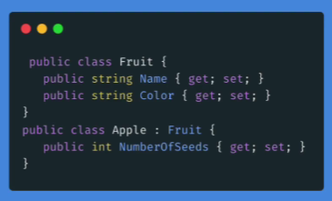

# Herencia en C#

### Cuáles son las características de OOP

OOP es una de las metodologías de programación más importantes en la actualidad. Todo el concepto depende de cuatro ideas principales, que se conocen como los pilares de la programación orientada a objetos. Estos cuatro pilares son los siguientes:

+ Herencia.
+ Encapsulación.
+ Polimorfismo.
+ Abstracción.

## Herencia  

La palabra herencia significa recibir o derivar algo de otra cosa.

+   **Qué es herencia en OOP**  
    En la vida real, podríamos hablar de un niño que hereda una casa de sus padres. No solo hereda la propiedad, sino todo el poder que tiene el padre sobre ese bien.

A la clase de la cual se heredan las demás se denomina **clase base** o **clase padre** y la clase heredada se denomina **clase hija**. 



### Sintaxis

La herencia en C# se declara con el símbolo ( : ), ejemplo:

```c#
    public class Fruit
    {
    public string Name { get; set; } = "";
    public string Color { get; set; } = "";
    }
```
Aquí se realiza la herencia: 
```c#
    public class Apple : Fruit
    // Apple es el nuevo nombre de la clase hija
    //Fruit es la clase base o padre
    {
    public int NumberOfSeeds { get; set; }
    }
```  

> La clase hija puede tener sus propios atributos y comportamientos únicos, pero, también contiene los atributos y métodos de su clase derivada.


